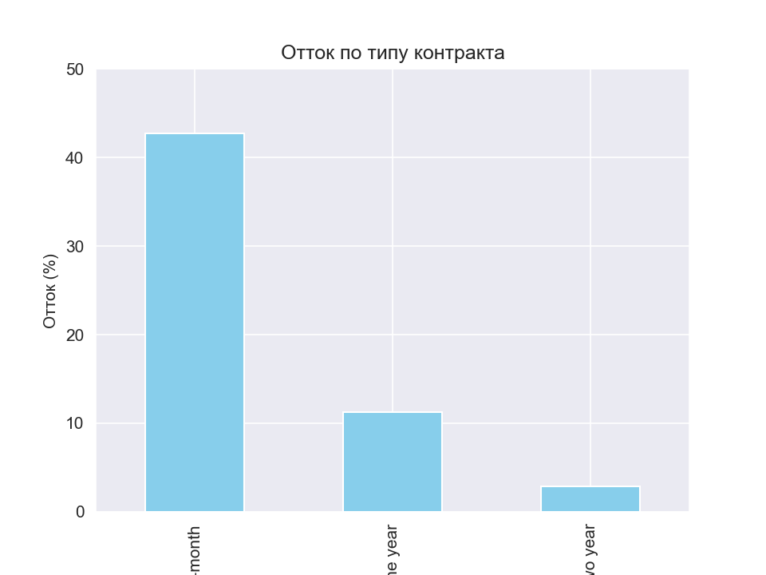
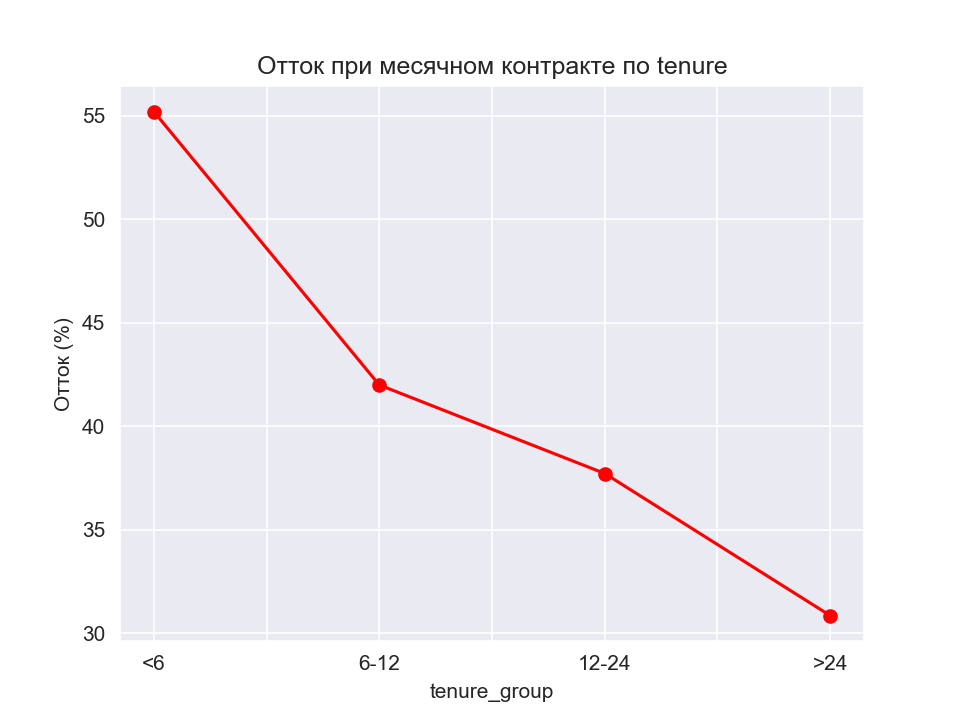

# Telco-Churn
# Анализ оттока клиентов телеком-компании

**Данные:** Telco Customer Churn (7043 клиента).  
**Цель:** выявить ключевые факторы, влияющие на отток, и предложить меры для удержания.

## Кейс 1: Тип контракта

**Фактор:** тип контракта (месячный, годовой, двухгодичный).  
**Условие:** без дополнительных условий.  
**Результат:**  
- Месячный контракт → отток **42.7%**  
- Годовой контракт → отток **11.3%**  
- Двухгодичный контракт → отток **2.8%**  

**Разница между месячным и двухгодичным:** 39.9 п.п.  

**Применение:**  
- Предлагать долгосрочные контракты клиентам, которые остались с нами более 3–6 месяцев.  
- Для клиентов с помесячным контрактом запускать персонализированные акции на переход на годовой.  

---

## Кейс 2: Длительность обслуживания (tenure) при фиксированном типе контракта

**Фактор:** tenure (группы: <6, 6-12, 12-24, >24 месяцев).  
**Условие:** отдельно для каждого типа контракта.

### Результаты

**Месячный контракт:**  
отток почти не меняется с tenure (≈10-12%), кроме группы >24 мес – небольшой рост.  
*Вывод:* при месячном контракте tenure не спасает, клиенты уходят в любой момент.

**Годовой контракт:**  
отток стабильно низкий (≈8-11%), tenure незначительно влияет.

**Двухгодичный контракт:**  
отток почти нулевой для всех групп, кроме >24 мес (3.1%).  

**Применение:**  
- Долгосрочные контракты надёжно удерживают клиентов.  
- Для клиентов с месячным контрактом нужно активное вовлечение (связь, скидки, персонализация), независимо от их стажа.  

---

## Графики

  
*Столбцы: процент оттока для каждого типа контракта.*

  
*Почти горизонтальная линия – tenure не помогает.*

---

## Общие выводы

- **Главный фактор оттока – тип контракта.** Долгосрочные контракты снижают отток в 5–15 раз.  
- **Длительность обслуживания (tenure)** вторична. Даже давние клиенты с месячным контрактом уходят с той же вероятностью.  
- **Рекомендация бизнесу:** активнее переводить клиентов на годовые/двухгодичные контракты, предлагая бонусы.

## Ссылки

- [Ноутбук с кодом](https://nbviewer.org/github/твой-ник/telco-churn/blob/main/telco_churn_analysis.ipynb)
- [Репозиторий](https://github.com/твой-ник/telco-churn)
